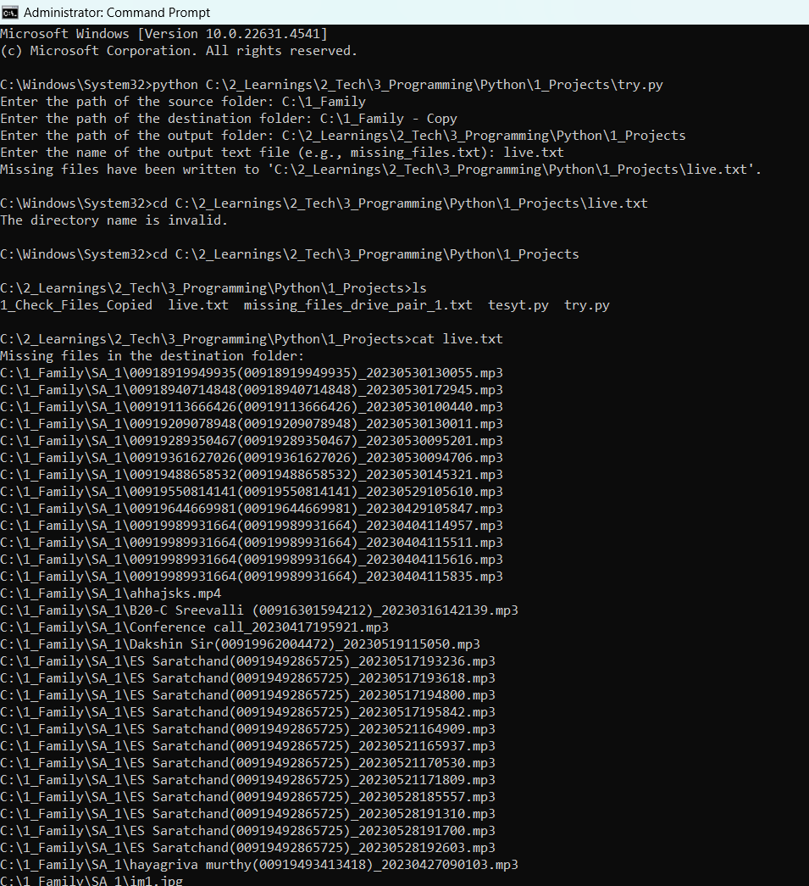

# Find Missing Files Script

## Overview

This Python script allows you to find and list files that are present in a source folder but missing from a destination folder. It is useful for verifying file transfers, backups, or ensuring that specific files are copied successfully to a desired location.

## Features

- Recursively checks all files in the source directory.
- Compares files against the specified destination directory.
- Generates a text file listing all missing files along with their original paths.
- Automatically creates the output directory if it does not exist.

## Requirements

- Python 3.x
- Standard library (No additional packages are required)

## Usage

1. **Clone this repository** to your local machine:

   ```bash
   git clone https://github.com/yourusername/FindMissingFiles.git
   ```

2. **Navigate into the project directory**:

   ```bash
   cd FindMissingFiles
   ```

3. **Run the script**:

   ```bash
   python showMissingFiles.py
   ```

   - **Input Prompts**:
     - You'll be prompted to enter the following:
       - Path of the source folder (the location where files are expected to be).
       - Path of the destination folder (the location to check for missing files).
       - Path of the output folder (where the output text file will be created).
       - Name of the output text file (e.g., `missing_files.txt`).

4. After running the script, check the specified output folder for the text file containing the list of missing files.

## Example

Enter the following paths when prompted:

- Source folder: `/path/to/source`
- Destination folder: `/path/to/destination`
- Output folder: `/path/to/output`
- Output filename: `missing_files.txt`

### Output

If there are missing files, the output text file will contain a list of the missing files:

```
Missing files in the destination folder:
/path/to/source/file1.txt
/path/to/source/folder/file2.jpg
```

If all source files are present in the destination, the output will be:

```
All files from the source folder are present in the destination folder.
```




## Notes

- Ensure that you have the necessary permissions to access the source and destination folders.
- The script does not check for empty folders.

## License

This project is licensed under the MIT License. See the LICENSE file for more details.

## Contact

If you have any questions or suggestions, feel free to reach out:

- Mahesh Kumar J
- jammumahi15@gmail.com
- [Your GitHub Profile](https://github.com/maheshkumarj)

